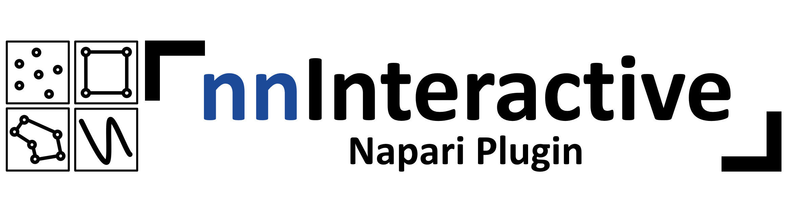
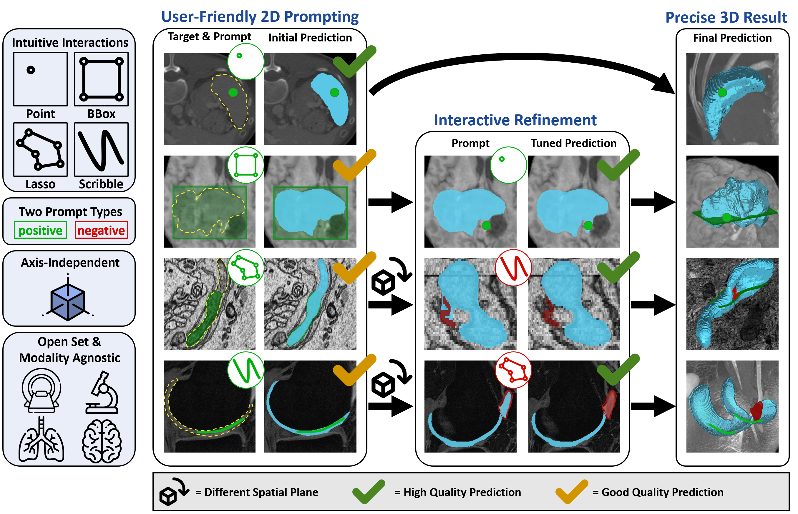
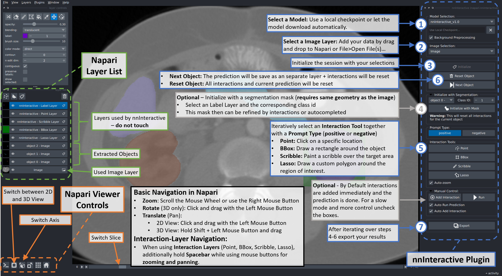

# nnInteractive: Redefining 3D Promptable Segmentation

Accurate and efficient 3D segmentation is essential for both clinical and research applications.
While foundation models like SAM have revolutionized interactive segmentation, their 2D design and domain shift limitations make them ill-suited for 3D medical images.
Current adaptations address some of these challenges but remain limited, either lacking volumetric awareness, offering restricted interactivity, or supporting only a small set of structures and modalities.
Usability also remains a challenge, as current tools are rarely integrated into established imaging platforms and often rely on cumbersome web-based interfaces with restricted functionality.
We introduce nnInteractive, the first comprehensive 3D interactive open-set segmentation method.
It supports diverse prompts—including points, scribbles, boxes, and a novel lasso prompt—while leveraging intuitive 2D interactions to generate full 3D segmentations.
Trained on 120+ diverse volumetric 3D datasets (CT, MRI, PET, 3D Microscopy, etc.), nnInteractive sets a new state-of-the-art in accuracy, adaptability, and usability.
Crucially, it is the first method integrated into widely used image viewers (e.g., Napari, MITK), ensuring broad accessibility for real-world clinical and research applications.
Extensive benchmarking demonstrates that nnInteractive far surpasses existing methods, setting a new standard for AI-driven interactive 3D segmentation.



## Demo Videos

[](https://www.youtube.com/watch?v=H_L6LL0FRoo)
[](https://www.youtube.com/watch?v=YoMZ7Xv7gKI)
[](https://www.youtube.com/watch?v=V0rqPYA3sjA)

## Installation

### Prerequisites

You need a Linux or Windows computer with a Nvidia GPU. 10GB of VRAM is recommended. Small objects should work with \<6GB.

##### 1. Create a virtual environment:

nnInteractive supports Python 3.10+ and works with Conda, pip, or any other virtual environment. Here’s an example using Conda:

```
conda create -n nnInteractive python=3.12
conda activate nnInteractive
```

##### 2. Install the correct PyTorch for your system

Go to the [PyTorch homepage](https://pytorch.org/get-started/locally/) and pick the right configuration.
Note that since recently PyTorch needs to be installed via pip. This is fine to do within your conda environment.

For Ubuntu with a Nvidia GPU, pick 'stable', 'Linux', 'Pip', 'Python', 'CUDA12.6' (if all drivers are up to date, otherwise use and older version):

```
pip3 install torch torchvision --index-url https://download.pytorch.org/whl/cu126
```

##### 3. Install this repository + dependencies via

- Download this repository by pressing the Download Repository button in the top right corner
- Extract the .zip file, For example `unzip napari-nninteractive-DP05.zip -d ./nninteractive` on Linux
- Navigate to the extracted folder (here `cd nninteractive`)
- Install nnInteractive with `pip install -e .`

**Note:** Model weights are automatically downloaded on first use. This can take up to a couple of minutes depending on your internet connection

## Getting Started

Use one of these three options to start napari and activate the plugin.
Afterward, Drag and drop your images into napari.

\***Note if getting asked which plugin to use for opening .nii.gz files use napari-nifti.**

a) Start napari, then Plugins -> nnInteractive.

```
napari
```

b) Run this to start napari with the plugin already started.

```
napari -w napari-nninteractive
```

c) Run this to start napari with the plugin and open an image directly

```
napari demo_data/liver_145_0000.nii.gz -w napari-nninteractive
```

# How to use

**Note:** To open Nifti (.nii.gz, .nii) files we recommend to select napari-nifti.



______________________________________________________________________

## Acknowledgments

<p align="left">
   &nbsp;&nbsp;&nbsp;&nbsp;
  
</p>

This repository is developed and maintained by the Applied Computer Vision Lab (ACVL)
of [Helmholtz Imaging](https://www.helmholtz-imaging.de/) and the
[Division of Medical Image Computing](https://www.dkfz.de/en/medical-image-computing) at DKFZ.

This [napari] plugin was generated with [copier] using the [napari-plugin-template].

[copier]: https://copier.readthedocs.io/en/stable/
[napari]: https://github.com/napari/napari
[napari-plugin-template]: https://github.com/napari/napari-plugin-template
